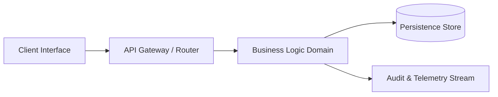

# Architecture Decision Record (ADR): Polyman Project Blueprint

## Executive Summary
This document establishes the structural topology, API contracts, and component seams for:
> **Task Scope:** Design the system architecture and component structure for the following project request:

TASK: Audit this workspace for OWASP Top 10 vulnerabilities and dependency licensing risks

Provide a complete Architecture Decision Record (ADR) with System Topology, Component Seams, Directory Structure, and API Contracts.

## 1. System Topology
- **Pattern:** Layered Microservice / Modular Monolith
- **Communication:** Async Event-Driven / REST
- **Persistence Layer:** ACID SQLite / PostgreSQL compatible schema
- **Runtime Target:** Containerized Node.js / Python Fast Execution

## 2. Component Boundaries


## 3. Directory Layout
```text
src/
├── core/
│   ├── config.ts / config.py
│   └── errors.ts
├── modules/
│   ├── domain/
│   └── handlers/
└── tests/
```

## 4. Contract Specifications
- Strict type assertions with zero `any` allowance.
- Standard JSON envelope with error tracking headers.
